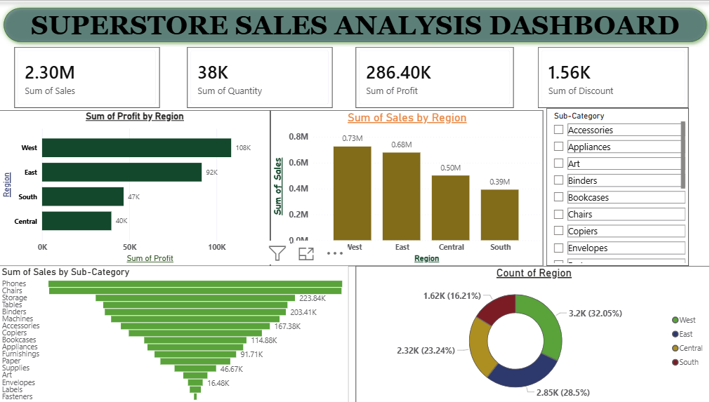

# 📊 Superstore Sales Analysis Dashboard

> A business intelligence dashboard built with **Microsoft Power BI** as part of the **FutureInterns Data Analytics Internship Program**.

---

## 🖼️ Dashboard Preview



---

## 📌 Project Overview

This project analyzes the **Superstore Sales Dataset** to uncover business insights across regions, product categories, and sub-categories. The goal is to help stakeholders make data-driven decisions by visualizing key performance metrics in an interactive Power BI dashboard.

---

## 🎯 Business Questions Answered

- Which regions generate the most revenue and profit?
- Which products and sub-categories are top sellers?
- Where should the business focus to grow faster?
- How are orders distributed across regions?

---

## 📈 Key Metrics

| KPI | Value |
|-----|-------|
| 💰 Total Sales | 2.30M |
| 📊 Total Profit | 286.40K |
| 🏷️ Sum of Discount | 1.56K |
| 📦 Total Quantity | 38K |

---

## 🗂️ Dashboard Visuals

| Visual | Description |
|--------|-------------|
| KPI Cards | Sales, Profit, Discount, Quantity at a glance |
| Profit by Region | Horizontal bar chart comparing regional profits |
| Sales by Region | Regional sales comparison |
| Sales by Sub-Category | Ranked bar chart of all product sub-categories |
| Count of Region | Donut chart showing order distribution by region |
| Category Slicer | Interactive filter for Furniture, Office Supplies, Technology |


---

## 🛠️ Tools Used

- **Microsoft Power BI Desktop** - Dashboard & visualizations
- **Microsoft Excel / CSV** - Data source
- **Kaggle** - Dataset source

---

## 📂 Dataset

**Superstore Sales Dataset**
- Source: [Kaggle - vivek468/superstore-dataset-final](https://www.kaggle.com/datasets/vivek468/superstore-dataset-final)
- Fields: Order ID, Region, Category, Sub-Category, Sales, Profit, Quantity, Discount, Ship Mode, Segment

---

## 🔍 Key Insights

- **West Region** leads in profit (108K) with the best profit-to-sales ratio
- **East Region** has the highest sales volume (0.68M)
- **Phones & Chairs** are the top-selling sub-categories
- **Central Region** has the lowest profit margin - suggesting over-discounting
- **South Region** has the lowest sales - biggest growth opportunity

---

## Business Insights & Recommendations
1. Revenue Growth Opportunities
•	Focus on growing South Region sales through targeted promotions and expanded product availability.
•	Bundle slow-moving sub-categories (Labels, Envelopes) with high-demand items like Phones.
•	Introduce loyalty programs in the East Region to sustain its high order volume.

2. Profit Optimization
•	Review discount strategy in Central Region - high sales but low profit suggests over-discounting.
•	Prioritize Phones, Chairs, and Storage in procurement to maintain supply for top categories.
•	Evaluate the profitability of Tables - high sales but often low-margin furniture items.

3. Operational Recommendations
•	Expand West Region operations - best profit-to-sales ratio among all regions.
•	Conduct customer segmentation analysis to identify high-value Consumer vs. Corporate buyers.
Monitor seasonal trends in Ship Mode to optimize logistics and reduce shipping costs

---

## 📁 Repository Structure

```
📦 FUTURE_DS_01
 ┣ 📊POWER BI DASHBOARD.pbix        # Power BI Dashboard file
 ┣ 📄 REPORT Task 1.pdf  # Full analysis report
 ┣ 📄 sample.csv                       # Dataset used
 ┣ 🖼️dashboard.png            # Dashboard screenshot
 ┗ 📄 README.md                        # Project documentation
```

---

## 🚀 How to Use

1. Clone this repository
   ```bash
   git clone https://github.com/sourabhsharma140107-cloud/superstore-sales-dashboard.git
   ```
2. Open `POWER BI DASHBOARD.pbix` in **Power BI Desktop**
3. Refresh data if needed by pointing to `sample.csv`
4. Explore the interactive dashboard!

---

## 🎓 Internship Details

- **Program:** FutureInterns Data Analytics Internship
- **Task:** Business Sales Analysis Dashboard
- **Skills Demonstrated:** Data cleaning, KPI analysis, trend analysis, business storytelling, dashboard design
